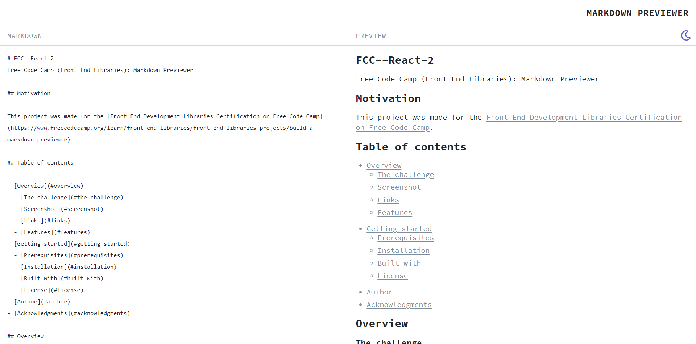
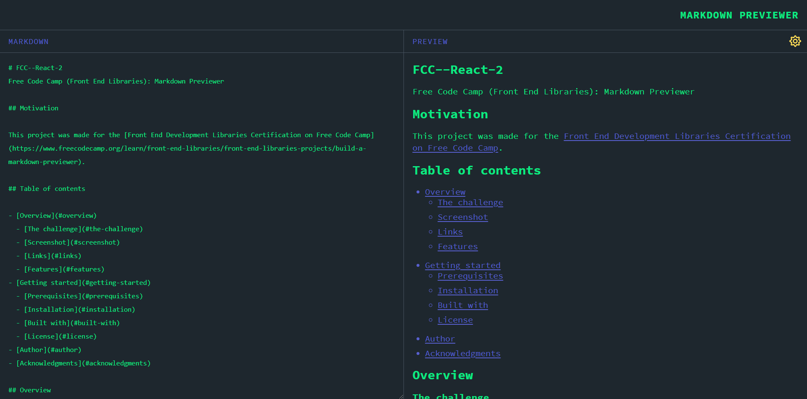
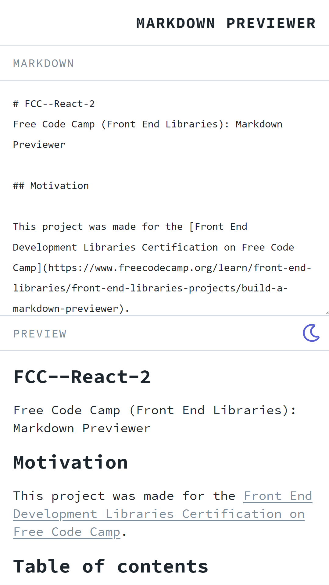
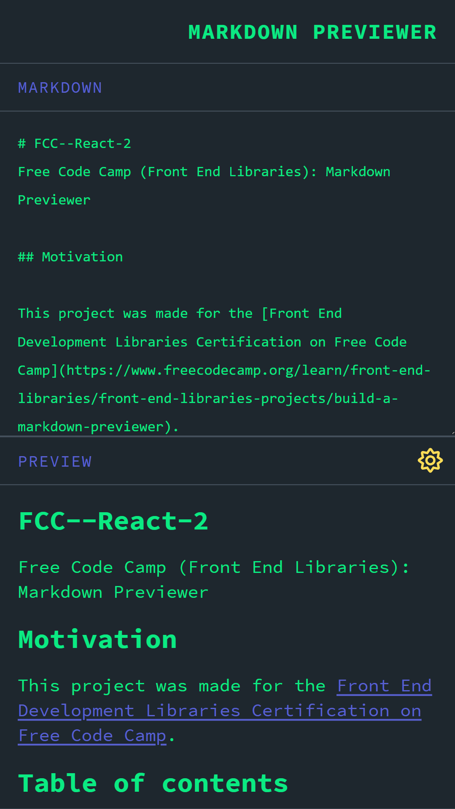

# Markdown Previewer
The following application is a markdown previewer that uses the [MarkedJS](https://github.com/markedjs/marked) package to parse and compile markdown and is built using [Parcel](https://parceljs.org/), [Sass](https://sass-lang.com/) and [ReactJS](https://reactjs.org/). 

## Motivation

This project was made for the [Front End Development Libraries Certification on Free Code Camp](https://www.freecodecamp.org/learn/front-end-libraries/front-end-libraries-projects/build-a-markdown-previewer).

## Table of contents

- [Overview](#overview)
  - [The challenge](#the-challenge)
  - [Screenshot](#screenshot)
  - [Links](#links)
  - [Features](#features)
- [Getting started](#getting-started)
  - [Prerequisites](#prerequisites)
  - [Installation](#installation)
  - [Built with](#built-with)
  - [License](#license)
- [Author](#author)
- [Acknowledgments](#acknowledgments)

## Overview

### The challenge

Users should be able to:

- [x] View the optimal layout depending on their device's screen size

- [x] Turn GitHub flavored markdown into rendered HTML in a separate display element

- [x] Interpret carriage returns

- [x] Display sample markdown on first load in the editor field and the corresponding rendered HTML in the preview field

### Screenshot

**Desktop View**
> Light theme



> Dark theme



**Mobile View**

> Light theme



> Dark theme



### Links

- Project URL: [Github Repository](https://github.com/N-Nikolaev/markdown-previewer)
- Live App URL: [Github Page](https://n-nikolaev.github.io/markdown-previewer)

### Features

This project was based on the sample project provided by Free Code Camp as an example output and has a number of additional features to distinguish itself from the provided sample output, these include:

- The application was built from scratch using ReactJS
- Parcel was used to bundle all the files to reduce file size
- The design was based off of the [Dillinger.io](https://dillinger.io/) markdown editor.
- Has light and dark mode theming
- Pulls a .txt copy of the README.md file for the initial load sample using the fetch API
- And is mobile responsive

## Getting started

### Prerequisites

You are going to need the latest version of NPM in order to install this project on your machine.
* npm
  ```sh
  npm install npm@latest -g
  ```
  
### Installation

1. Clone the repository
   ```sh
   git clone https://github.com/N-Nikolaev/markdown-previewer.git
   ```
2. Install NPM packages
   ```sh
   npm install
   ```

### Built with

- Semantic HTML5 markup
- CSS custom properties
- CSS Grid
- Mobile-first workflow
- [SASS](https://sass-lang.com/) - CSS preprocessor
- [Parcel](https://parceljs.org/) - Web application bundler
- [ReactJS](https://reactjs.org/) - JavaScript library / framework
- [FontAwesome](https://fontawesome.com/) - Icon toolkit
- [MarkedJS](https://github.com/markedjs/marked) - Markdown parser and compiler
- [DOMPurify](https://github.com/cure53/DOMPurify) - DOM only XSS sanitizer
- [PrismJS](https://prismjs.com/) - Light-weight syntax highlighter
- [Favicon.io](https://favicon.io/) - Favicon generator
- [Flatuicolors.io](https://flatuicolors.com/) - Premade color palettes

### License

Distributed under the MIT License. See `LICENSE` for more information.

### Useful resources

1. [FCC - Markdown Previewer Example Project](https://codepen.io/freeCodeCamp/full/GrZVVO)
2. [React passing data between siblings](https://youtu.be/Qf68sssXPtM)
3. [Composition vs Inheritance](https://reactjs.org/docs/composition-vs-inheritance.html)
4. [Context API](https://reactjs.org/docs/context.html)
5. [Using marked in React](https://stackoverflow.com/questions/34686523/using-marked-in-react/34688574)
6. [How to write secure code in React](https://medium.com/@rezaduty/how-to-write-secure-code-in-react-937579011d3c)
7. [Beyond Console Log in 100 Seconds](https://www.youtube.com/watch?v=L8CDt1J3DAw)
8. [Get PrismJS working in React](https://medium.com/get-it-working/get-prismjs-working-in-react-a6d989e59290)

## Author

- Github - [Nikolay Nikolaev](https://github.com/N-Nikolaev)
- Frontend Mentor - [@N-Nikolaev](https://www.frontendmentor.io/profile/N-Nikolaev)

## Acknowledgments

- [Free Code Camp](https://www.freecodecamp.org/learn)
- [ReactJS](https://reactjs.org/)
- [Parcel](https://parceljs.org/)
- [SASS](https://sass-lang.com/)
- [SASS Guidelines](https://sass-guidelin.es/)
- [FontAwesome](https://fontawesome.com/)
- [MarkedJS](https://github.com/markedjs/marked)
- [DOMPurify](https://github.com/cure53/DOMPurify)
- [PrismJS](https://prismjs.com/)
- [Favicon.io](https://favicon.io/)
- [Flatuicolors.io](https://flatuicolors.com/)
- [Medium - Jason Ewins](https://medium.com/@jtradex)
- [Fireship](https://fireship.io/)
- [Kevin Powell](https://www.kevinpowell.co/)
- [Stack Overflow](https://stackoverflow.com/)
